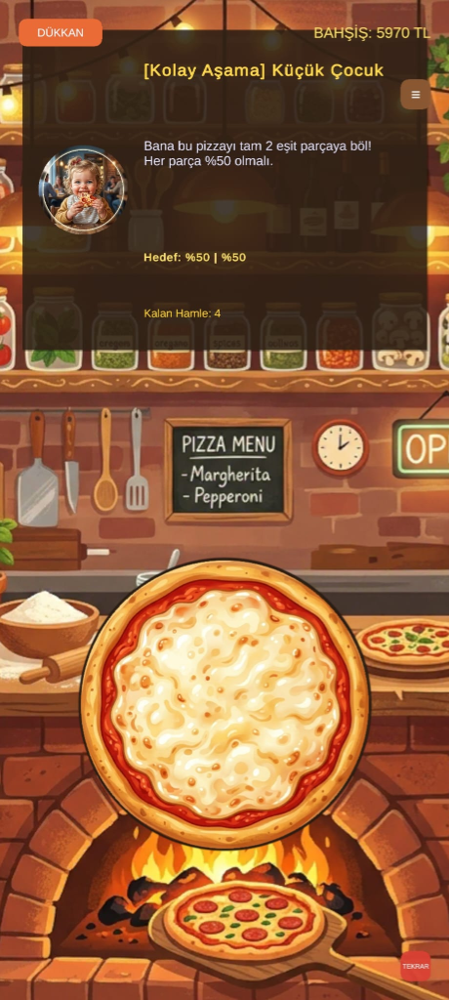

# 🍕 2D Pizza Slicing Game — Unity & C# (AI-Assisted Development)

> **Geliştirici:** Burak Şenol  
> **Teknolojiler:** Unity Engine (2D), C#, 2D Physics Engine, LineRenderer, Dynamic Slicing

---

## 📌 Projeye Genel Bakış (Overview)

Bu proje, Unity 2D fizik motoru ve C# script mimarisi kullanılarak geliştirilmiş, dokunma ve fare hareketleriyle nesneleri dinamik olarak dilimleyen interaktif bir gündelik (casual) mobil/web oyun prototipidir.

Oyun geliştirme sürecinde **üretken yapay zeka araçları (LLM)** bir kodlama asistanı ve pair-programming partneri olarak konumlandırılmış; dilimleme geometrisi, çarpışma kontrolleri ve oyun döngüsü optimizasyonları hızlı bir şekilde prototiplenmiştir.

---

## 📸 Oyun İçi Görsel (Gameplay)

  
   
  <em>Unity 2D Arayüzü: Dilimleme Etkileşimi ve Dinamik Skorlama</em>

---

## ⚙️ Temel Mekanikler & Mimari Detayları

### 1. 🔪 Dinamik Dilimleme Mekaniği (Line & Slice Detection)
* Kullanıcının ekran üzerindeki kaydırma hareketini (drag & swipe) Input.mousePosition ve Camera.ScreenToWorldPoint vektörleriyle raycast izleme.
* Dilimleme hattının başlangıç ve bitiş noktalarını hesaplayarak hedef sprite/collider üzerindeki kesişim noktalarını belirleme.

### 2. ⚡ Fizik & Çarpışma Algılama (2D Physics Engine)
* Dilimlenen parçaların Rigidbody2D ve PolygonCollider2D bileşenleri yardımıyla gerçekçi yerçekimi ve savrulma fiziğiyle ayrılması.
* Tetikleyici (Trigger) optimizasyonları ile gereksiz fizik hesaplamalarının önüne geçilerek yüksek kare hızı (60 FPS) hedeflenmesi.

### 3. 🎯 Skorlama & Oyun Döngüsü (Game Loop & State Management)
* Dilimleme doğruluğu ve hızına göre puan çarpanları (combo multiplier) hesaplayan C# singleton GameManager yapısı.
* Hata toleransı ve yeniden başlama mekaniklerini yöneten durum makinesi (State Machine).

---

## 🛠️ Teknoloji & Geliştirme Yığını

| Bileşen | Detay |
| :--- | :--- |
| **Oyun Motoru** | Unity 2D |
| **Programlama Dili** | C# (.NET) |
| **Fizik Sistemi** | Unity 2D Physics (Rigidbody2D, Box/Polygon Colliders) |
| **Geliştirme Metodolojisi** | AI Pair-Programming (Prompt Engineering & Rapid Prototyping) |

---

## 👨‍💻 Geliştirici & İletişim

**Burak Şenol**  
Düzce Üniversitesi Bilgisayar Mühendisliği 4. Sınıf Öğrencisi  
* **LinkedIn:** [linkedin.com/in/burak-senol](https://linkedin.com/in/burak-senol)  
* **GitHub:** [github.com/burak-senol-dev](https://github.com/burak-senol-dev)  
* **E-Posta:** [buraksenol10@gmail.com](mailto:buraksenol10@gmail.com)